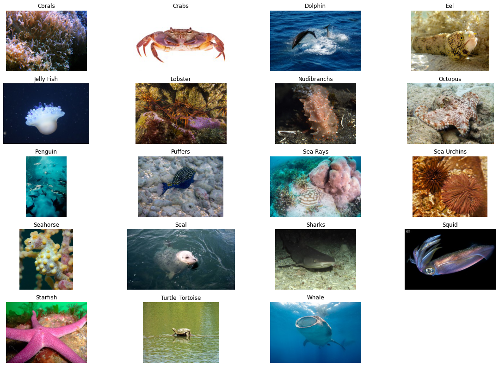
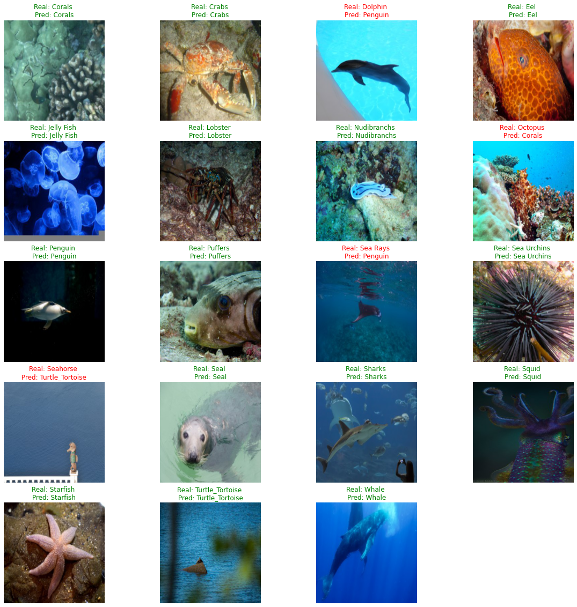

  <h1>Sea Animals Detection</h1>
  

### Goal

The goal of this project is to create a deep learning model to successfully classify 19 different Sea Animals.
The Animals in the Dataset are: Corals, Crabs, Dolphin, Eel, Jelly Fish, Lobster, Nudibranchs, Octopus, Penguin, Puffers, Sea Rays, Sea Urchins, Seahorse, Seal, Sharks, Squid, Starfish, Turtle/Tortoise, Whale

### Dataset

The dataset for this project is taken from the Kaggle. 
Here is the link for the dataset: https://www.kaggle.com/datasets/vencerlanz09/sea-animals-image-dataste that was used.

### What Have I Done?

- Imported all the required libraries and dataset for this project.
- Visualized Images
- Split the Dataset into Training & Testing
- Used the Following Models:
  - Basic CNN Model using keras
  - More Advanced CNN Model using MaxPool & Conv2d layers
  - Transfer Learning (using Imagenet)
- Visualize the Accuracy Curve
- Visualize the Error Curve
- Predicted random images from Test Sets for each class

### Libraries Used:

- tensorflow
- matplotlib
- random
- os
- shutil
- kaggle

### Model 1 - Basic CNN:

### Model 2 - Conv + MaxPool CNN:

### Model 3 - Transfer Learning:

### Accuracies

Model 1:

- Loss: 2.8513
- Accuracy: 16.178%

Model 2:

- Loss: 3.8102
- Accuracy: 31.168%

Model 3:

- Loss: 1.4065
- Accuracy: 81.699%

## Prediction Results from Model 3

## Conclusion

We can thus successfully classify these 19 different Sea Animals with good  degree of accuracy. We can conclude that using pre-trained model has the highest accuracy in minimals number of Epochs.

### Author

Code Contributed by: Kunal Agrawal

Github: kunalagra
